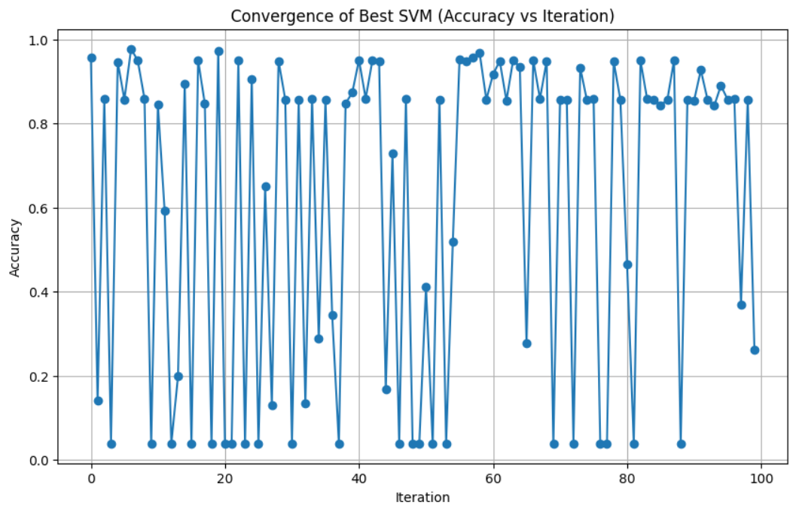

# Optimized Support Vector Machine (SVM) - Multi-Class Classification

This project focuses on optimizing a Support Vector Machine (SVM) classifier for a multi-class classification task using the **Letter Recognition** dataset from the UCI Machine Learning Repository.

## 📌 Dataset Used

- **Name**: Letter Recognition
- **Source**: [UCI Machine Learning Repository](https://archive.ics.uci.edu/ml/datasets/letter+recognition)
- **Loaded using**: `letter_recognition = fetch_ucirepo(id=59)`
- **Description**: The dataset contains 20,000 instances of capital English letters, described by 16 numerical attributes based on pixel features.
- **Classes**: 26 (A to Z)

---

## ⚙️ Project Objective

- Split the dataset 10 times into **70% training** and **30% testing** randomly.
- Optimize SVM hyperparameters using **10 iterations** for each sample.
- Track and compare the **best accuracy and parameters** for each sample.
- Plot the **convergence graph** (accuracy vs. iterations) for the best-performing sample.

---

## ✅ Results Summary

| Sample # | Best Accuracy | Best SVM Parameters                                                                 |
|----------|---------------|--------------------------------------------------------------------------------------|
| S1       | 0.9753        | `{'kernel': 'rbf', 'C': 35.979, 'gamma': 0.0509, 'degree': 3, 'coef0': 0}`           |
| S2       | 0.9773        | `{'kernel': 'rbf', 'C': 4.315, 'gamma': 0.0683, 'degree': 3, 'coef0': 0}`            |
| S3       | 0.9743        | `{'kernel': 'rbf', 'C': 8.062, 'gamma': 0.0636, 'degree': 3, 'coef0': 0}`            |
| S4       | 0.9627        | `{'kernel': 'rbf', 'C': 5.748, 'gamma': 0.0093, 'degree': 3, 'coef0': 0}`            |
| S5       | 0.9743        | `{'kernel': 'rbf', 'C': 49.246, 'gamma': 0.0425, 'degree': 3, 'coef0': 0}`           |
| S6       | 0.9745        | `{'kernel': 'rbf', 'C': 31.516, 'gamma': 0.0272, 'degree': 3, 'coef0': 0}`           |
| S7       | 0.9750        | `{'kernel': 'rbf', 'C': 16.010, 'gamma': 0.0341, 'degree': 3, 'coef0': 0}`           |
| S8       | 0.9757        | `{'kernel': 'rbf', 'C': 60.007, 'gamma': 0.0188, 'degree': 3, 'coef0': 0}`           |
| S9       | 0.9743        | `{'kernel': 'rbf', 'C': 29.442, 'gamma': 0.0548, 'degree': 3, 'coef0': 0}`           |
| S10      | 0.9737        | `{'kernel': 'rbf', 'C': 3.378, 'gamma': 0.0869, 'degree': 3, 'coef0': 0}`            |

➡️ **Best Performing Sample**: **Sample 2 (S2)** with **97.73% accuracy**

---

## 📈 Convergence Plot

Below is the convergence graph (fitness vs iterations) for **Sample 2**, which achieved the highest accuracy:

---

## 🔍 Analysis

- **Kernel**: All samples performed best with `RBF` kernel.
- **Hyperparameters**:
  - `C` and `gamma` values greatly influence performance.
  - All models used `degree=3` and `coef0=0`, as is typical for RBF.
- **Accuracy Range**: 96.27% to 97.73% — indicating robust model performance.

---
